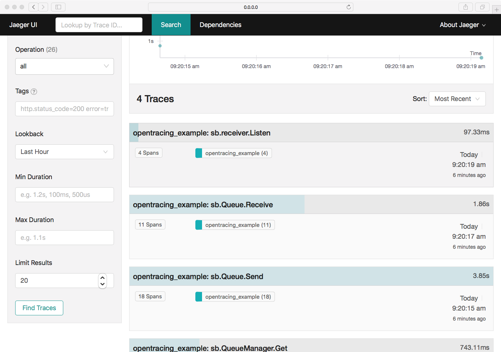
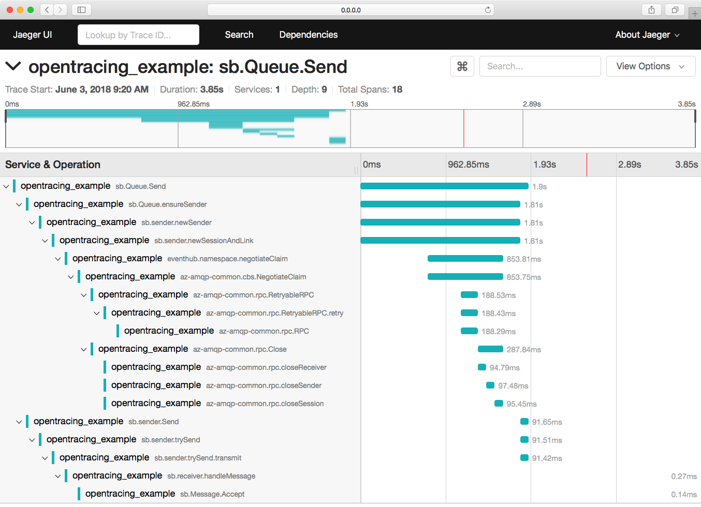
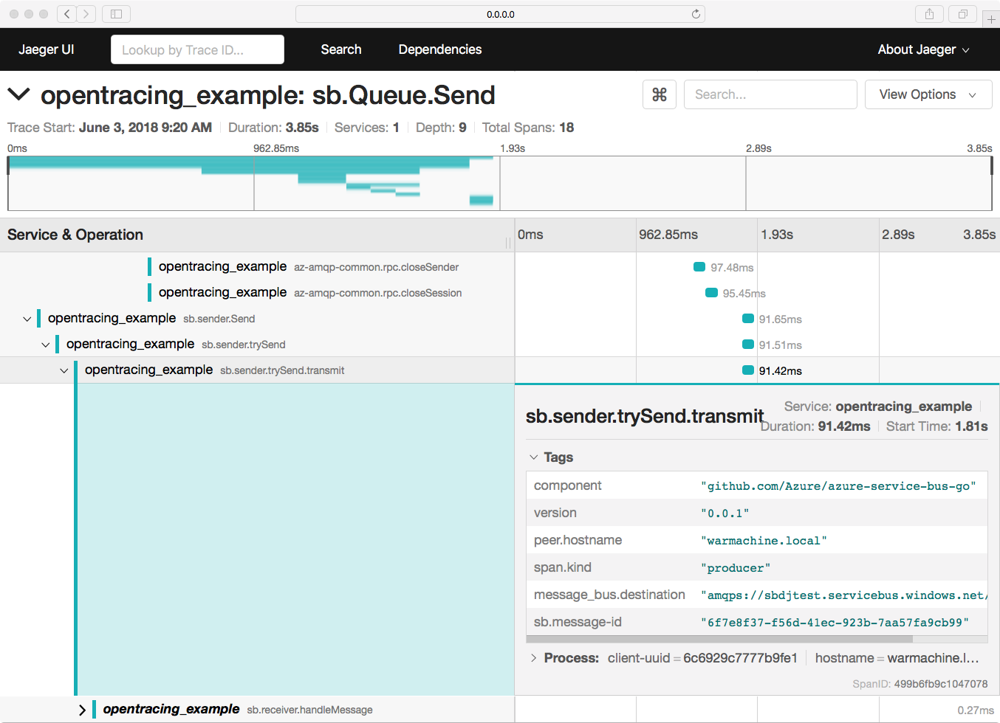
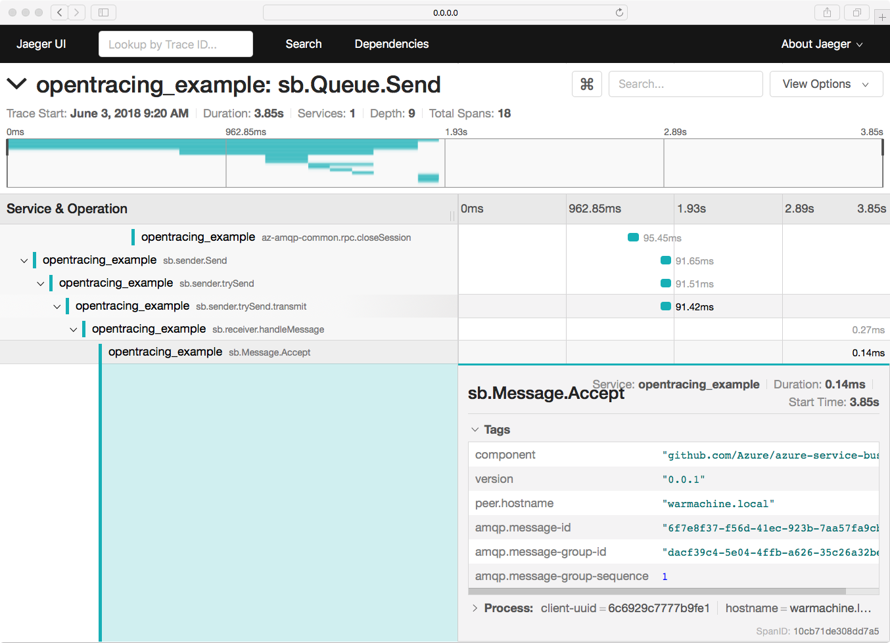

# OpenTracing Support Example

This example illustrates how to take advantage of [OpenTracing](http://opentracing.io) support in the library to enable 
distributed message tracing.

## Setup
- Create an Azure Service Bus namespace with a queue named "helloworld" in the [Azure Portal](https://protal.azure.com).
- After creation copy the Service Bus connection string and use it as shown below.

## To Run
- Start a Jaeger tracing service via docker:
  - `id=$(docker run -d -e COLLECTOR_ZIPKIN_HTTP_PORT=9411 -p 5775:5775/udp -p 6831:6831/udp -p 6832:6832/udp -p 5778:5778 -p 16686:16686 -p 14268:14268 -p 9411:9411 jaegertracing/all-in-one:latest)`
- From the project's root directory execute:
  - `SERVICEBUS_CONNECTION_STRING='your-SB-conn-string' go test -run ^Example_opentracing$ .`
- The test should execute and pass, taking just a few seconds. 

## Viewing the Traces with Jaeger
Open the [Jaeger UI via http://0.0.0.0:16686](http://0.0.0.0:16686/search). You should 
be able to select the service `opentracing_example`. Select that service from the list.
 

### Find Traces
Click on `Find Traces` to see the root traces from the example execution. You should
see something like the following image.

### Sending a Message
Click on `sb.Queue.Send` to see what happens when we send a message. Most operations in
the Azure Service Bus library have been instrumented for tracing.

Sending the first message through a new Queue connection requires a new session and
authorization negotiation. Subsquent messages will not incur the overhead of negotiating 
authorization. Upon successful negotiation, the message is transmitted to the queue. 
The message is then consumed by a receiver.

You should see an image like below when clicking on `sb.Queue.Send`

#### Transmitting a Message
If you now expand `sb.sender.trySendTransmit` to explore send operation details. You will
see an image similar to the one below, which provides meta information about the message and
destination.

### Receiving a Message
If you now expand `sb.Message.Accept` you should see meta information about the message as it
is being accepted by the receive handler.

## Summary
The above example shows how simply enabling OpenTracing collection and configuring
a trace collector you can collect distributed tracing using the Azure Service Bus
library for Golang.

## Teardown
You can stop the Jaeger docker container used above by running
`docker stop $id`.
  