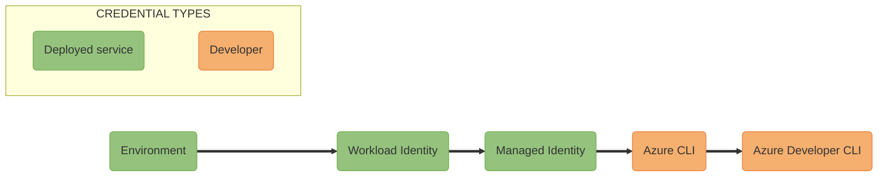

```mermaid
%% STEPS TO GENERATE IMAGE
%% =======================
%% 1. Install mermaid CLI (see https://github.com/mermaid-js/mermaid-cli/blob/master/README.md)
%% 2. Run command: mmdc -i DefaultAzureCredentialAuthFlow.md -o DefaultAzureCredentialAuthFlow.svg

flowchart LR;
    A(Environment):::deployed ==> B(Workload Identity):::deployed ==> C(Managed Identity):::deployed ==> D(Azure CLI):::developer ==> E(Azure Developer CLI):::developer;

    subgraph CREDENTIAL TYPES;
        direction LR;
        Deployed(Deployed service):::deployed --- Developer(Developer):::developer;

        %% Hide links between boxes in the legend by setting width to 0. The integers after "linkStyle" represent link indices.
        linkStyle 4 stroke-width:0px;
    end;

    %% Define styles for credential type boxes
    classDef deployed fill:#95C37E, stroke:#71AD4C;
    classDef developer fill:#F5AF6F, stroke:#EB7C39;

    %% Add API ref links to credential type boxes
    click A "https://pkg.go.dev/github.com/Azure/azure-sdk-for-go/sdk/azidentity#EnvironmentCredential" _blank;
    click B "https://pkg.go.dev/github.com/Azure/azure-sdk-for-go/sdk/azidentity#WorkloadIdentityCredential" _blank;
    click C "https://pkg.go.dev/github.com/Azure/azure-sdk-for-go/sdk/azidentity#ManagedIdentityCredential" _blank;
    click D "https://pkg.go.dev/github.com/Azure/azure-sdk-for-go/sdk/azidentity#AzureCLICredential" _blank;
    click E "https://pkg.go.dev/github.com/Azure/azure-sdk-for-go/sdk/azidentity#AzureDeveloperCLICredential" _blank;
```
