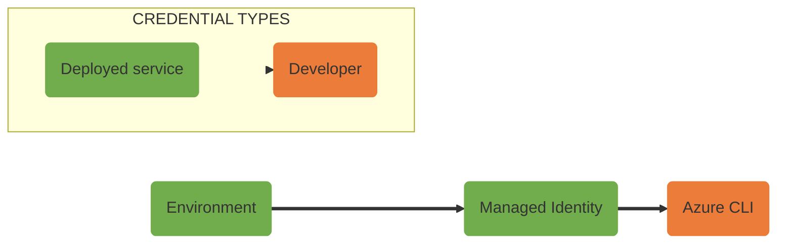

```mermaid
%% STEPS TO GENERATE IMAGE
%% =======================
%% 1. Install mermaid CLI (see https://github.com/mermaid-js/mermaid-cli/blob/master/README.md)
%% 2. Run command: mmdc -i DefaultAzureCredentialAuthFlow.md -o DefaultAzureCredentialAuthFlow.svg

flowchart LR;
    A(Environment):::deployed ==> B(Managed Identity):::deployed ==> C(Azure CLI):::developer;

    subgraph CREDENTIAL TYPES;
        direction LR;
        Deployed(Deployed service):::deployed ==> Developer(Developer):::developer;

        %% Hide links between boxes in the legend by setting width to 0. The integers after "linkStyle" represent link indices.
        linkStyle 2 stroke-width:0px;
    end;

    %% Define styles for credential type boxes
    classDef deployed fill:#71AD4C, stroke:#71AD4C;
    classDef developer fill:#EB7C39, stroke:#EB7C39;

    %% Add API ref links to credential type boxes
    click A "https://docs.microsoft.com/python/api/azure-identity/azure.identity.environmentcredential?view=azure-python" _blank;
    click B "https://docs.microsoft.com/python/api/azure-identity/azure.identity.managedidentitycredential?view=azure-python" _blank;
    click C "https://docs.microsoft.com/python/api/azure-identity/azure.identity.azureclicredential?view=azure-python" _blank;
```
