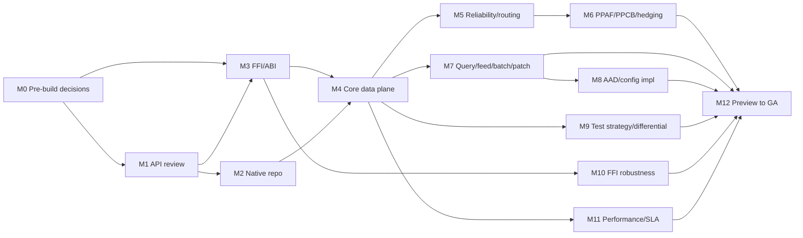

<!-- cspell:ignore amd64 azcosmos cgo glibc musl RNTBD PPAF PPCB rustls thinclient epk -->
# Cosmos DB Go v2 (Rust-driver via FFI): Delivery Planning Document

> **Status:** Draft for review
> **Audience:** Cosmos SDK engineers and leads; Go Central SDK reviewers
> (Joel Hendrix, Steve Kuznetsov).
> **Purpose:** A milestone-based delivery plan for building the Cosmos DB Go v2
> SDK on top of the Rust Cosmos driver through cgo/FFI. This is a plan for
> turning into GitHub epics and issues — not an implementation, and not a
> re-argument of FFI vs. pure-Go (that decision is recorded in
> [azure-sdk-for-go#27238](https://github.com/Azure/azure-sdk-for-go/pull/27238)
> and ADR `docs/adr/0001-go-v2-uses-ffi.md`).

Sizing throughout is planning-range guidance for a Copilot-assisted team, not a
commitment. Engineer-week ranges size the work; the calendar targets in the
delivery-estimate companion doc assume agentic tooling for the mechanical parts.

---

## 1. Overview & goals

Go v2 is a **major, breaking release** of the `azcosmos` SDK that replaces the
hand-written Go data-plane logic with calls into the **prebuilt Rust Cosmos
driver** through a C ABI and cgo. The Rust driver is the behavioral source of
truth; Go v2 binds to it rather than reimplementing routing, retries, sessions,
failover, or query execution.

The reason to do this now is twofold. First, the Rust driver already implements
the advanced availability and routing behavior customers expect, and that
behavior keeps advancing (Gateway 2.0, PPAF, PPCB, hedging). Re-porting each
advance into Go by hand would keep Go permanently behind. Second, Go v1 shipped
without much of that behavior; treating Go v2 as the "real GA" for Go lets us
close the gap in one deliberate step.

### Goals

1. **Feature-complete parity with the Rust driver's reliability behavior**, with
   these capabilities as first-class v2 deliverables:
   - **Gateway 2.0** transport (regional proxy forwarding RNTBD-over-HTTP/2),
     selected automatically when the account advertises thin-client endpoints
     ([#4319](https://github.com/Azure/azure-sdk-for-rust/pull/4319),
     [#4763](https://github.com/Azure/azure-sdk-for-rust/pull/4763)).
   - **PPAF** — per-partition automatic failover
     (`PARTITION_LEVEL_FAILOVER_SPEC.md`;
     [#4555](https://github.com/Azure/azure-sdk-for-rust/pull/4555)).
   - **PPCB** — per-partition circuit breaker, enabled by default in the driver
     ([#4588](https://github.com/Azure/azure-sdk-for-rust/pull/4588),
     [#4655](https://github.com/Azure/azure-sdk-for-rust/pull/4655)).
   - **Hedging** — cross-region request hedging for tail latency
     (`HEDGING_SPEC.md`).
   - **Reliability & routing** — retry/error classification (including HTTP 449
     RetryWith in-region retry), session-token handling, partition-key-range and
     location/topology routing.
2. **A clean, idiomatic Go v2 public API** designed once, informed by the new
   capabilities, rather than grown incrementally on top of v1.
3. **A supportable native-binary distribution** so customers get the driver via
   normal `go get`/`go build` on the supported platforms, with signed,
   provenance-tracked artifacts.
4. **Major/breaking, but minimize customer churn.** v2 changes what must change
   for the new capabilities and the FFI-backed design, and preserves what can be
   preserved. Because Go is currently <1% of external Cosmos request volume, the
   existing user base is small — but their migration cost is still an explicit,
   managed deliverable, not an afterthought.
5. **Ship Go v2 GA at the Rust driver's GA-planned version, not a moving target.**
   The Rust driver is still advancing (`azure_data_cosmos_driver` is pre-1.0 and
   unreleased). Go v2 GA pins to the **specific Rust driver version that Rust
   itself commits to for GA** and rides its ABI, so "done" is a fixed feature set
   rather than a chase of `main`. M1 records that pinned version; later Rust
   advances land in a Go v2 point/next release, not by widening the GA scope.

---

## 2. Non-goals / out of scope

- **A pure-Go port of the driver.** Rejected for v2; the pure-Go spike remains a
  validation reference only.
- **A functional non-cgo build.** There is no `CGO_ENABLED=0` data path; the
  `!cgo` build produces a clear unsupported-configuration diagnostic only.
- **Long-tail platforms at GA.** Anything outside the initial target matrix
  (below) ships later as add-on driver modules, not in the first GA.
- **New driver behavior invented in Go.** If a capability is missing from the
  Rust driver or cannot be represented safely across the C ABI, that is Rust
  driver work and is out of scope for this plan (it expands the estimate).
- **Reimplementing the differential harness from scratch.** It exists; v2
  productizes it as a release gate.

---

## 3. Guiding constraints (decided — do not relitigate)

- Go v2 = FFI over the Rust driver; **cgo required**; only a `!cgo` diagnostic,
  no functional non-cgo path.
- Native binaries live in a **separate Azure-owned repository (Option C)**; the
  public `azcosmos` package stays in `azure-sdk-for-go`.
- **Initial target matrix: "Big 5 + musl"** — Windows amd64/arm64, Linux
  amd64/arm64 (glibc), macOS arm64, **plus Linux musl amd64/arm64 (Alpine)**.
  musl is in scope because container/Kubernetes (Dapr/AKS) workloads depend on
  it. macOS amd64 and everything else are long-tail add-on driver modules.
- **ABI compatibility is a contract** (ABI major + a compatible range), not exact
  Go module-version pinning, because Go MVS selects minimum versions.
- The **Rust driver is the source of truth**; the differential/validation
  harness is a release gate, not an experiment.
- Estimates assume a **Copilot-assisted team**; human time concentrates on
  API/ABI decisions, validation, and approvals.
- **cgo is transitive/infectious**: any Go library that imports `azcosmos/v2`
  forces its own consumers to require cgo. This is a product constraint, called
  out in the FFI decision record.

---

## 4. Current state

**Rust driver — mature and advancing.** The driver crate
(`azure_data_cosmos_driver`) already ships the behavior Go v2 needs, and it is
still moving forward release over release:

| Capability | Driver evidence |
|---|---|
| Gateway 2.0 (RNTBD-over-HTTP/2 thin client) | [#4319](https://github.com/Azure/azure-sdk-for-rust/pull/4319), disable/override switch [#4763](https://github.com/Azure/azure-sdk-for-rust/pull/4763) |
| PPCB (per-partition circuit breaker), on by default | [#4588](https://github.com/Azure/azure-sdk-for-rust/pull/4588), env-resolution fix [#4655](https://github.com/Azure/azure-sdk-for-rust/pull/4655) |
| PPAF (per-partition automatic failover) + hub-region read caching | [#4555](https://github.com/Azure/azure-sdk-for-rust/pull/4555), `PARTITION_LEVEL_FAILOVER_SPEC.md` |
| HTTP 449 RetryWith in-region retry | [#4319](https://github.com/Azure/azure-sdk-for-rust/pull/4319) |
| Change feed pull (start-from, continuation, envelope) | [#4621](https://github.com/Azure/azure-sdk-for-rust/pull/4621), [#4723](https://github.com/Azure/azure-sdk-for-rust/pull/4723) |
| Runtime/client options split, throughput control, fault injection | [#4588](https://github.com/Azure/azure-sdk-for-rust/pull/4588) |
| Diagnostics verbosity / summary JSON | [#4733](https://github.com/Azure/azure-sdk-for-rust/pull/4733) |
| Local native query planning (avoids gateway round-trip) | [#4554](https://github.com/Azure/azure-sdk-for-rust/pull/4554) |
| Cross-SDK User-Agent feature flags (PPCB, HTTP/2) | [#4635](https://github.com/Azure/azure-sdk-for-rust/pull/4635) |
| Preview distributed transactions | [#4702](https://github.com/Azure/azure-sdk-for-rust/pull/4702) |

**Native FFI wrapper — exists, being hardened.** The C ABI wrapper crate
`azure_data_cosmos_driver_native` (`NATIVE_WRAPPER_SPEC.md`) wraps the driver
crate directly (it supersedes the older `azure_data_cosmos_native`, removed in
[#4103](https://github.com/Azure/azure-sdk-for-rust/pull/4103)). Its struct
shapes and headers were recently cleaned up
([#4906](https://github.com/Azure/azure-sdk-for-rust/pull/4906)), and there is a
Rust→Go C ABI POC ([#4569](https://github.com/Azure/azure-sdk-for-rust/pull/4569)).

**Go v1 — small, lightly used surface.** Go is <1% of external Cosmos request
volume. v1 lacks much of the failover/routing behavior above. This is why v2 can
be a clean break and why the migration burden on existing users is bounded.

**Distribution design — decided.** Option C (separate native-driver repo,
per-platform Go modules) plus the cgo selection and `!cgo` diagnostic are
recorded in `go-ffi-distribution-design.md`.

---

## 5. New capabilities Go v2 exposes

This table drives Milestone 1. "Breaking?" is relative to Go v1. Each row must
be confirmed against the cited Rust source during M1.

| Capability | What it is | Rust source | How it surfaces in Go v2 | Breaking vs v1? |
|---|---|---|---|---|
| **Gateway 2.0** | Regional proxy forwarding RNTBD-over-HTTP/2; auto-selected on thin-client accounts | `GATEWAY_V2_SPEC.md`; [#4319](https://github.com/Azure/azure-sdk-for-rust/pull/4319), [#4763](https://github.com/Azure/azure-sdk-for-rust/pull/4763) | Mostly transparent; a connection/transport option + disable switch | New behavior; option surface new |
| **PPAF** | Per-partition automatic failover; hub-region read caching | `PARTITION_LEVEL_FAILOVER_SPEC.md`; [#4555](https://github.com/Azure/azure-sdk-for-rust/pull/4555) | Failover options on the client; mostly automatic | New; option surface new |
| **PPCB** | Per-partition circuit breaker, on by default | [#4588](https://github.com/Azure/azure-sdk-for-rust/pull/4588), [#4655](https://github.com/Azure/azure-sdk-for-rust/pull/4655) | Partition-failover options; env-var parity (`AZURE_COSMOS_PPCB_*`) | New; default-on behavior change |
| **Hedging** | Cross-region request hedging for tail latency | `HEDGING_SPEC.md` | Availability-strategy option on client/operation | New |
| **Reliability & routing** | Retry/error classification (incl. 449 RetryWith), session tokens, pk-range + location routing | `TRANSPORT_PIPELINE_SPEC.md`, `ErrorCodesAndRetries.md`, `PARTITION_KEY_RANGE_CACHE_SPEC.md`; [#4319](https://github.com/Azure/azure-sdk-for-rust/pull/4319) | Error types, retry/throttle options, consistency/session options | Changed error model |
| **Query execution** | Cross-partition fan-out, continuations, optional local query plan | `FEED_OPERATIONS_REQS.md`; [#4554](https://github.com/Azure/azure-sdk-for-rust/pull/4554) | Query pager with continuation tokens | Likely changed API |
| **Change feed** | Pull model; start-from; envelope with metadata | [#4621](https://github.com/Azure/azure-sdk-for-rust/pull/4621), [#4723](https://github.com/Azure/azure-sdk-for-rust/pull/4723) | Change-feed pager + start-position types | New/changed |
| **Patch / transactional batch** | Patch handler; batch results | `PATCH_HANDLER_SPEC.md`; [#4702](https://github.com/Azure/azure-sdk-for-rust/pull/4702) | Patch + batch APIs | Changed API |
| **Throughput control** | Throughput bucket / priority level, groups | [#4588](https://github.com/Azure/azure-sdk-for-rust/pull/4588) | Per-operation options + group registration | New |
| **Diagnostics** | Verbosity levels; summary JSON default | [#4733](https://github.com/Azure/azure-sdk-for-rust/pull/4733) | Diagnostics on responses/errors | Changed shape |
| **AAD / token auth** | Token-credential auth alongside key auth | driver auth surface | Credential type + refresh callback across FFI | Likely changed API |
| **Hierarchical partition keys** | Multi-hash HPK, prefix queries | [#4729](https://github.com/Azure/azure-sdk-for-rust/pull/4729) | PartitionKey builder for HPK | Possibly changed API |

---

## 6. Milestones

Sizing is Copilot-assisted engineer-weeks. "Critical path" means it blocks the
release train; "parallel" means it can proceed once its inputs are stable.

> **Testing and FFI robustness are continuous, not end-of-line milestones.**
> Per Go v1 team feedback, the test strategy (M9) and the FFI-boundary robustness
> checks (M10) are ironed out **alongside every milestone**, not deferred to the
> end. Two things move to the front as a result: the **test-scope decision** is
> settled in M0 *before* building starts, and the **auth-over-FFI** and
> **telemetry-over-FFI** *modeling decisions* are made up front (with M3) even
> though their *implementation* lands later. From the vertical slice onward, every
> milestone carries its own differential tests and exercises the M10 boundary
> conditions for the surface it adds.

### M0 — Pre-build decision gate  *(before any building starts)*
**Intent:** Settle the few cross-cutting decisions that, if deferred, force
expensive rework once the FFI boundary and features exist. These are decisions,
not implementations.

- **Scope:**
  - **Test-scope decision (settle now).** Choose between the two testing stances
    below so the harness and every later milestone's test tasks are built to it:
    - *Option 1 — lean:* test the Go binding + Go-visible behavior only and trust
      the Rust suite for driver internals. Lower cost, no duplicated coverage;
      relies on the Rust suite staying strong.
    - *Option 2 — defense-in-depth:* additionally re-run a curated subset of Rust
      driver correctness scenarios *through Go*. Higher on-call confidence, at the
      cost of duplicated maintenance and slower CI.
  - **Auth-over-FFI modeling decision (design only).** Today the Rust driver and
    Go v1 both take credentials from the common Azure Identity library, and the
    customer supplies them in a language-native way. In Go v2 the customer will
    still configure auth *the Go way* (an `azcore`/`azidentity` `TokenCredential`),
    so the design question is **how a Go-side credential and its token-refresh are
    marshalled/packed across the C ABI** (token hand-off, refresh callback
    direction, lifetime, cancellation). Decide the model now so the ABI (M3) can
    carry it; the implementation is M8.
  - **Telemetry/diagnostics-over-FFI modeling decision (design only).** Same
    pattern as auth: decide **how telemetry, diagnostics, and the User-Agent
    feature-flag token cross the boundary** (what the driver emits vs. what Go
    adds, and how it is shaped across the ABI). Decide the model with M3;
    implementation follows later.
- **Out of scope:** Any binding, feature, or telemetry/auth implementation code.
- **Deliverables:** A recorded test-scope decision (Option 1 or 2); an
  auth-over-FFI design note; a telemetry-over-FFI design note — each feeding the
  M3 ABI shape.
- **Entry criteria:** Kickoff approval.
- **Exit criteria:** All three decisions signed off so M1/M3 can proceed without
  reopening them.
- **Risks:** Deciding auth/telemetry marshalling late would change the ABI after
  features are built on it.
- **Sizing:** 1–2 ew. **Critical path — precedes M1.**

### M1 — Go v2 API surface review & design  *(gating milestone)*
**Intent:** Define the Go v2 public API before any building starts.

- **Scope:** Enumerate the current v1 public surface (`sdk/data/azcosmos`) and
  classify every area as **kept / changed / new**. Design the v2 API for the
  capabilities in §5. Produce the breaking-change list and a v1→v2 migration
  sketch. Confirm each capability against its Rust spec/PR.
- **Out of scope:** Any binding, driver, or packaging code.
- **Deliverables:** Approved API design doc; capability table (§5) verified;
  breaking-change inventory; migration sketch; naming conventions.
- **Entry criteria:** Kickoff approval; access to Rust specs and v1 surface.
- **Exit criteria:** API design signed off by Cosmos leads and a Go Central SDK
  reviewer; every §5 row marked new/changed/kept with a cited source; migration
  sketch reviewed.
- **Risks:** Over-scoping the break; under-representing a capability's API impact.
- **Sizing:** 2–4 ew. **Critical path.**

### M2 — Native-driver repository & engineering system
**Intent:** Stand up the Option C native-binary home and its release machinery.

- **Scope:** Create the Azure-owned native-driver repo; per-platform Go modules;
  Rust cross-build matrix for the Big-5+musl targets; signing, provenance/SBOM,
  checksums; direct-dependency policy approval; versioning model.
- **Out of scope:** Go public API; FFI method design (M3).
- **Deliverables:** Repo + CI; per-target module skeletons; signed artifact
  pipeline; approved dependency-policy exception.
- **Entry criteria:** M1 target-matrix confirmation; policy approval started.
- **Exit criteria:** A signed native artifact for at least one target published
  and consumable from a scratch module; pipeline reproducible in CI.
- **Risks:** Dependency-policy exception delayed; toolchain matrix churn.
- **Sizing:** 3–5 ew. **Parallel with M1/M3** once matrix is fixed.

### M3 — FFI / C ABI boundary & cgo layer
**Intent:** Turn the wrapper crate + POCs into a productized, versioned ABI.

- **Scope:** Finalize the exposed C ABI methods (lifecycle, config, operation
  execution, continuations, error mapping, cancellation); ownership/lifetime
  rules; error/status/diagnostics shape; async/completion model; Go binding;
  cgo `GOOS`/`GOARCH` selection + `!cgo` diagnostic guard. **Bake the M0
  auth-over-FFI and telemetry-over-FFI models into the ABI shape** (credential
  token hand-off + refresh-callback direction; diagnostics/telemetry emission)
  so later implementation milestones don't have to reshape the boundary. Build a
  one-target vertical slice proving clean `go get`/`go build`.
- **Out of scope:** Full feature breadth (M4–M8); auth/telemetry *implementation*
  (M8 / later) — only their ABI representation is settled here.
- **Deliverables:** Versioned headers; ABI compatibility policy; Go binding
  skeleton; vertical slice on one target; ABI carriers for the auth and
  telemetry models from M0.
- **Entry criteria:** M0 decisions (test scope + auth/telemetry FFI models);
  `NATIVE_WRAPPER_SPEC.md`, POC [#4569](https://github.com/Azure/azure-sdk-for-rust/pull/4569), header cleanup [#4906](https://github.com/Azure/azure-sdk-for-rust/pull/4906).
- **Exit criteria:** A developer consumes the slice on one target without
  installing Rust or copying a library; ABI contract tests pass; **the vertical
  slice is exercised against the M10 FFI-boundary conditions** (error
  propagation, panic safety, cancellation, memory ownership) as the first
  robustness checkpoint.
- **Risks:** ABI cannot cleanly express a needed capability (→ driver work);
  async/cancellation lifetime bugs across the boundary.
- **Sizing:** 3–5 ew. **Critical path.**

### M4 — Core data plane over FFI
**Intent:** First usable slice of real operations.

- **Scope:** Client/database/container/item lifecycle; **key auth**; partition
  keys incl. hierarchical; point create/read/replace/upsert/delete; error
  mapping to Go error types; diagnostics surfacing.
- **Out of scope:** Advanced availability (M6); AAD (M8).
- **Deliverables:** Working point-ops client on the vertical-slice target;
  Go error model; diagnostics on responses.
- **Entry criteria:** M3 ABI + binding.
- **Exit criteria:** Point ops pass differential + live-account tests on ≥1
  target.
- **Risks:** Byte/memory ownership at the cgo boundary; HPK edge cases.
- **Sizing:** 3–5 ew. **Critical path.**

### M5 — Reliability & routing substrate
**Intent:** The behavior that makes v2 "real GA" for Go.

- **Scope:** Retry/error classification (incl. 449 RetryWith), session-token
  handling, pk-range + location/topology routing, failover plumbing, **Gateway
  2.0 transport** selection and disable switch.
- **Out of scope:** PPAF/PPCB/hedging surfacing (M6, though driver already
  implements them).
- **Deliverables:** Routing/retry/session behavior verified through the binding;
  Gateway 2.0 auto-selection observable.
- **Entry criteria:** M4 core data plane.
- **Exit criteria:** Differential parity on retry/session/routing scenarios;
  Gateway 2.0 exercised against a thin-client-capable account.
- **Risks:** Session-token and routing corner cases; transport-selection config.
- **Sizing:** 3–6 ew. **Critical path.**

### M6 — Advanced availability features
**Intent:** Surface and validate the marquee availability features end-to-end.

- **Scope:** **PPAF**, **PPCB** (default-on parity incl. `AZURE_COSMOS_PPCB_*`
  env vars), **hedging** availability strategy — options surfaced in the Go API
  and validated end-to-end.
- **Out of scope:** New availability behavior not already in the driver.
- **Deliverables:** Go options for failover/circuit-breaker/hedging; env-var
  parity; validation scenarios.
- **Entry criteria:** M5 substrate.
- **Exit criteria:** PPAF/PPCB/hedging scenarios pass differential + fault-
  injection tests; default-on PPCB matches driver behavior.
- **Risks:** Representing failover/hedging options faithfully; multi-region test
  setup.
- **Sizing:** 3–5 ew. **Critical path.**

### M7 — Query, feed, change feed, bulk/batch, patch
**Intent:** Depth features with pagination/continuations.

- **Scope:** Cross-partition query fan-out + continuation tokens; change feed
  pull (start-from, envelope); transactional batch; patch; bulk where in scope.
- **Out of scope:** Server-side features not in the driver.
- **Deliverables:** Query/change-feed pagers; batch/patch APIs; continuation
  round-tripping.
- **Entry criteria:** M4 (+ M5 for routing-sensitive queries).
- **Exit criteria:** Query/change-feed/batch/patch pass differential tests incl.
  HPK prefix queries and continuation resumption.
- **Risks:** Continuation-token fidelity; change-feed envelope mapping.
- **Sizing:** 4–7 ew. **Parallel after M4.**

### M8 — AAD/token auth & configuration completeness  *(implementation)*
**Intent:** Implement the auth model decided in M0/M3 and close the options gap.

- **Scope:** Implement the AAD/token-credential path **to the design already
  settled in M0 and carried by the M3 ABI** — token hand-off and refresh callback
  across FFI; remaining client/runtime configuration (consistency, throughput
  control, diagnostics verbosity, user-agent suffix). No new auth-marshalling
  design here; this is the build-out of that decision.
- **Out of scope:** Non-Cosmos credential types; re-opening the FFI auth model.
- **Deliverables:** Token-credential path; option parity with the Rust surface.
- **Entry criteria:** M0 auth model; M3 callback ABI; M4 client; sequenced after
  M7.
- **Exit criteria:** Token auth works against a live account; option parity
  verified; token-refresh callback passes the M10 re-entrancy/cancellation
  robustness checks.
- **Risks:** Token-refresh lifetime/cancellation across the boundary.
- **Sizing:** 2–4 ew. **After M7.**

### M9 — Test strategy, validation & differential gate  *(release gate)*
**Intent:** Make correctness a gate, not an experiment — and be explicit about
*what* Go v2's tests actually prove.

**Testing philosophy — what are we testing?** The Rust driver's internal
correctness (routing, retries, sessions, failover, query execution) is owned and
tested in the Rust repo; Go v2 does not re-derive it. Go v2 testing owns three
layers:

- **Binding correctness (Go's job):** input marshalling across the C ABI,
  output/diagnostics interpretation, error and sub-status mapping,
  context/cancellation, and the option surfaces. Pure Go unit/integration tests.
- **Differential — Go-visible behavior:** Go-through-FFI must produce the same
  caller-visible outcome as the Rust driver for the same inputs against the same
  backend state, with the **Rust driver as the oracle**. Reuse the existing
  emulator-fronting harness, and add an **in-memory / Go-pipe variant** that wires
  Go directly to the Rust in-memory emulator (`azure_data_cosmos_driver`'s
  `in_memory_emulator`) so both sides exercise identical, deterministic state
  without a live account.
- **FFI robustness (the boundary itself):** covered in **M10**.

**Testing runs alongside every milestone — not at the end.** The test-scope
stance (Option 1 lean vs. Option 2 defense-in-depth) is chosen in **M0** so the
harness is built to it up front. From the vertical slice (M3/M4) onward, **each
feature milestone (M4–M8) owns its own test tasks as exit criteria** — binding +
differential coverage for the surface it adds, plus the M10 boundary checks for
that surface. This milestone (M9) is the umbrella that wires those per-milestone
gates into CI and keeps the harness (including the in-memory-pipe runner)
healthy; it is not a late "now we test" phase.

- **Deliverables:** CI-wired binding + differential gates across the target
  matrix; the in-memory-pipe differential runner; live-account smoke.
- **Entry criteria:** M0 test-scope decision; M4+ features to exercise.
- **Exit criteria:** every supported feature has binding + differential + live
  evidence; smoke passes on all Big-5+musl targets.
- **Risks:** harness coverage gaps; flaky multi-region/live tests; Option 2
  scope creep if chosen.
- **Sizing:** 3–5 ew, then ongoing. **Runs alongside M3–M8.**

### M10 — FFI robustness & fault testing  *(continuous, starts at the vertical slice)*
**Intent:** Prove the C ABI boundary is safe under everything that isn't a happy
path. This is new surface with no Go v1 precedent, so it is called out as its own
track — but it **runs alongside the phases, starting the moment the FFI boundary
first exists (M3/M4 vertical slice)**, and every later milestone re-runs the
relevant conditions against the surface it adds.

- **Scope (applied per milestone, from the vertical slice onward):**
  - **Error propagation:** every Rust `Result`/status/sub-status crosses to a Go
    `error` with no loss of activity id, RU charge, or diagnostics.
  - **Edge-case payloads:** nil/empty/oversized bodies, invalid UTF-8, boundary
    integers, deeply nested JSON.
  - **Panic safety:** a Rust panic never crosses as a process abort — it surfaces
    as a Go error and leaves the client usable.
  - **Cancellation:** Go `context` cancel/deadline cuts an in-flight FFI call and
    reclaims resources.
  - **Hangs / deadlocks:** timeout watchdogs; detect blocked or pinned OS threads;
    no permanent goroutine leak.
  - **Memory ownership:** run under ASan/LSan and the Go race detector — no leak,
    double-free, or use-after-free across the boundary; a clear allocate/free
    ownership contract per call.
  - **Concurrency:** many goroutines sharing one client; callback re-entrancy
    (AAD token-refresh invoked from Rust back into Go across the boundary).
- **Out of scope:** feature behavior (that's M4–M8/M9).
- **Deliverables:** an FFI fault-injection suite wired into CI; a sanitizer build
  lane; a documented cross-boundary memory-ownership model; a per-milestone
  boundary-conditions checklist run as part of each milestone's exit.
- **Entry criteria:** M3 boundary exists (first checkpoint on the vertical slice).
- **Exit criteria:** suite passes on every target; no leaks/aborts under
  sanitizers; ownership model documented; **each milestone from M3 onward has
  cleared its boundary-conditions checklist.** **Runs alongside M3–M8; gates GA.**
- **Risks:** platform-specific cgo/thread behavior; sanitizer availability per
  target.
- **Sizing:** 3–5 ew.

### M11 — Performance & FFI-boundary SLA validation
**Intent:** The FFI boundary is new latency/throughput surface; validate it
against Cosmos SLA expectations before GA rather than discovering overhead late.

- **Scope:**
  - **Baseline from Rust:** use the Rust benchmark suite
    (`azure_data_cosmos_benchmarks`; see its `docs/PPCB_MEMORY_ANALYSIS.md` for the
    methodology from Tomas and the Rust perf group) as the native reference.
  - **Boundary cost:** measure the *added* cost of Go-over-FFI vs. Rust-native for
    the same op and target — per-call cgo transition latency, argument/result
    marshalling, and copy overhead.
  - **Under load:** throughput and tail latency (**P99**, gated against the Cosmos
    latency SLA) under concurrency; GC / goroutine-scheduler interaction given cgo
    pins an OS thread per in-flight call; memory/allocation profile.
  - **Regression tracking:** perf gates in CI with budgets so boundary overhead
    can't silently grow release over release.
- **Deliverables:** a Go perf harness reusing the Rust benchmark scenarios; a
  published per-op FFI-overhead budget and a P99 comparison vs. Rust-native.
- **Entry criteria:** M4 data plane works.
- **Exit criteria:** measured FFI overhead within the agreed budget; P99 meets the
  SLA target on the reference matrix; perf gate wired into CI. **Gates GA.**
- **Risks:** cgo call overhead above budget on some ops (may force batching or a
  marshalling redesign); thread-pinning under high concurrency.
- **Sizing:** 3–5 ew.

### M12 — Preview → GA hardening
**Intent:** Ship a supportable GA.

- **Scope:** Validate the full **Big-5+musl** matrix incl. Alpine/container smoke
  tests; cross-compilation guidance; supportability/telemetry playbook; docs,
  samples, **v1→v2 migration guide**; pinned feedback issue in `azure-sdk-for-go`;
  Dapr/AKS + User-Agent OS/arch input; rollout. (Performance and FFI-robustness
  baselines are owned by M11/M10 and consumed here as GA gates.)
- **Out of scope:** Long-tail platforms; features beyond the driver.
- **Deliverables:** GA-quality docs/migration; container-validated matrix;
  release/rollback rehearsal; feedback burn-down.
- **Entry criteria:** M5–M11 complete for the GA feature set.
- **Exit criteria:** Clean build + sample on every claimed target incl. Alpine;
  disabled cgo / unsupported platform produce intentional documented behavior;
  migration guide validated; preview feedback resolved.
- **Risks:** musl/Alpine linking surprises; cgo adoption friction; missing build
  tags for a target (the azblob lesson).
- **Sizing:** 3–5 ew, then ongoing. **Critical path to GA.**

---

## 7. Sequencing / waves

- **Wave 0 — decide, then unblock:** M0 pre-build decisions (test scope +
  auth/telemetry FFI models) → M1 API sign-off + M2 dependency-policy approval +
  ABI compatibility rule under MVS. Nothing large starts before these decisions,
  the API, and the target matrix are fixed.
- **Wave 1 — prove the boundary:** M3 vertical slice (carrying the M0 auth/
  telemetry ABI models) + M4 core data plane; M2 native pipeline in parallel;
  M10 FFI robustness begins as soon as the boundary exists and M9 testing tracks
  each milestone. **Critical path.**
- **Wave 2 — reliability depth:** M5 then M6; M7 in parallel; **M8 AAD
  implementation after M7**; M9 differential and M11 performance wired in
  throughout.
- **Wave 3 — GA:** M12 hardening on the full matrix.

**Decision gates:** M0 pre-build decisions — test scope (Option 1 vs 2) +
auth-over-FFI model + telemetry-over-FFI model · API sign-off (end M1) · ABI
freeze incl. auth/telemetry carriers (end M3) · target-matrix sign-off (M2,
already Big-5+musl) · per-milestone FFI-robustness checkpoints (M10, from M3
onward) + perf-budget sign-off (M11) · GA gate (end M12).

---

## 8. Cross-cutting concerns

- **Supportability:** 24/7 Azure Support needs diagnostics parity and a triage
  playbook that spans Go binding ↔ C ABI ↔ Rust driver.
- **Telemetry / User-Agent:** advertise SDK + enabled features via the cross-SDK
  feature-flag token, consistent with the driver
  ([#4635](https://github.com/Azure/azure-sdk-for-rust/pull/4635)). **How
  telemetry/diagnostics cross the FFI boundary is a design decision taken up front
  in M0 and carried by the M3 ABI; the implementation follows later.**
- **Security / supply chain:** signed artifacts, provenance/SBOM, checksums,
  CVE-response ownership spanning both repos.
- **Versioning / ABI policy:** ABI major + compatible range, honoring Go MVS
  minimum selection; coordinated wrapper/driver releases.
- **cgo transitive impact:** downstream Go libraries importing `azcosmos/v2`
  inherit the cgo requirement and a target-compatible C toolchain for
  cross-compilation. Document loudly.

---

## 9. Open questions / decisions needed

- **macOS amd64** inclusion in the initial matrix (currently a long-tail add-on).
- **Long-tail platform add-ons** priority (BSDs, Windows ABI variants, etc.).
- **Module paths / naming** for the native-driver modules and the v2 package.
- **API naming conventions** for the new option surfaces (failover, hedging).
- **v1 deprecation timeline** and support overlap window.
- **Pinned Rust driver GA version** Go v2 GA rides on (fixed in M1).

**Decisions moved to the front (settle in M0, before building — see M0):**
- **Test scope:** Option 1 (lean — binding + Go-visible behavior only) vs.
  Option 2 (defense-in-depth — also re-run a Rust correctness subset through Go).
- **Auth-over-FFI model:** how a Go-native `TokenCredential` and its refresh
  callback are marshalled across the C ABI (design in M0/M3; implemented in M8).
- **Telemetry-over-FFI model:** how diagnostics/telemetry and the User-Agent
  feature token cross the boundary (design in M0/M3; implemented later).

> The **initial target matrix is already decided: Big 5 + musl.** Do not reopen
> it here.

---

## 10. Milestone summary

| M | Intent | Sizing (ew) | Depends on | Path | Exit criterion (short) |
|---|---|---:|---|---|---|
| M0 | Pre-build decisions (test scope + auth/telemetry FFI models) | 1–2 | — | Critical (pre-M1) | 3 decisions signed off; feed M3 ABI |
| M1 | Go v2 API surface review & design | 2–4 | M0 | Critical | API signed off; §5 verified; migration sketch |
| M2 | Native-driver repo & eng system | 3–5 | M1 (matrix) | Parallel | Signed artifact consumed from scratch module |
| M3 | FFI/C ABI boundary & cgo layer | 3–5 | M0, M1 | Critical | Vertical slice builds via `go get` on 1 target; auth/telemetry carriers in ABI; first M10 checkpoint |
| M4 | Core data plane over FFI | 3–5 | M2, M3 | Critical | Point ops pass differential + live |
| M5 | Reliability & routing substrate | 3–6 | M4 | Critical | Retry/session/routing + Gateway 2.0 parity |
| M6 | Advanced availability (PPAF/PPCB/hedging) | 3–5 | M5 | Critical | Availability scenarios pass fault-injection |
| M7 | Query/feed/change feed/batch/patch | 4–7 | M4 | Parallel | Depth features pass differential incl. HPK |
| M8 | AAD/token auth & config (implementation) | 2–4 | M0/M3 model, M7 | After M7 | Token auth live; option parity |
| M9 | Test strategy, validation & differential gate | 3–5+ | M0, M4+ | Alongside M3–M8 | Per-milestone binding + differential + smoke green on all targets |
| M10 | FFI robustness & fault testing | 3–5 | M3 | Alongside M3–M8 | No leaks/aborts/hangs under sanitizers; per-milestone checklist cleared |
| M11 | Performance & FFI-boundary SLA validation | 3–5 | M4 | Gates GA | FFI overhead within budget; P99 meets SLA |
| M12 | Preview → GA hardening | 3–5+ | M5–M11 | Critical | Full Big-5+musl matrix + migration validated |

**Indicative total:** ~35–58 engineer-weeks across the milestones, dominated by
the feature-breadth milestones (M5/M6/M7), the API/ABI decisions (M0/M1/M3), and
the new FFI robustness/performance validation (M10/M11), with testing (M9) and
FFI robustness (M10) running **alongside** the phases rather than at the end.
Calendar targets and team-shape guidance are in the companion delivery-estimate
document.
